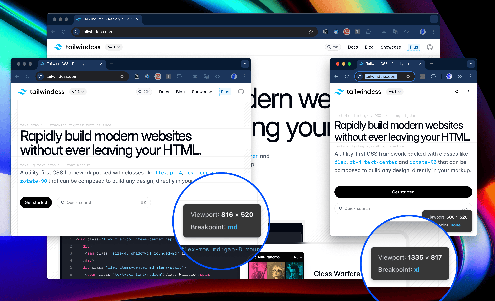

# Tailgunner - Tailwind CSS Breakpoint Helper

A lightweight Chrome extension that displays your current viewport size and corresponding Tailwind CSS breakpoint in real-time.



## 📋 Overview

Tailgunner helps web developers by providing an unobtrusive, real-time display of:
- Current viewport dimensions (width × height)
- Active Tailwind CSS breakpoint

The extension creates a semi-transparent panel in the bottom-right corner of your browser that updates automatically as you resize your window, making it easier to develop responsive designs with Tailwind CSS.

## ⚙️ Installation

### From Chrome Web Store
1. Visit the [Chrome Web Store](https://chrome.google.com/webstore)
2. Search for "Tailgunner"
3. Click "Add to Chrome"

### Manual Installation (Developer Mode)
1. Download or clone this repository
2. Open Chrome and navigate to `chrome://extensions/`
3. Enable "Developer mode" using the toggle in the top-right corner
4. Click "Load unpacked" and select the Tailgunner directory
5. The extension should now appear in your toolbar

## 🚀 Usage

1. Navigate to any webpage.
2. Click the Tailgunner icon in your Chrome toolbar.
3. A panel will appear in the bottom-right corner of your browser.
4. The panel shows current viewport dimensions and the active Tailwind CSS breakpoint.
5. Resize your browser window to see the values update in real-time.
6. Click the extension icon again to hide the panel.

## 🔍 Features

- **Real-time Viewport Size**: Displays the current width and height in pixels
- **Tailwind Breakpoint Detection**: Shows which Tailwind breakpoint is active
- **Standard Breakpoints**: Supports all standard Tailwind breakpoints (sm, md, lg, xl, 2xl)
- **Unobtrusive Design**: Semi-transparent panel stays out of your way
- **Toggle Visibility**: Easily show/hide with a single click
- **Responsive Updates**: Updates instantly as you resize your browser

## 🧩 Permissions and Manifest Settings

The extension uses Manifest V3 and requires minimal permissions to function:

| Permission | Purpose | Justification |
|------------|---------|---------------|
| `activeTab` | Allows the extension to interact with the currently active tab | Required to inject the viewport panel into the current page. Limited to the active tab only for security and privacy. Does not access browsing history or other tabs. |
| `host_permissions: <all_urls>` | Allows content scripts to run on all websites | Required to show the viewport panel on any website. Does not collect any data from these sites. |

Manifest settings:

```json
{
  "manifest_version": 3,
  "name": "Tailgunner",
  "description": "Displays viewport size and Tailwind CSS breakpoint",
  "version": "1.0",
  "permissions": [
    "activeTab"
  ],
  "host_permissions": [
    "<all_urls>"
  ],
  "background": {
    "service_worker": "background.js"
  },
  "action": {
    "default_title": "Toggle Tailgunner Panel"
  },
  "content_scripts": [
    {
      "matches": [
        "<all_urls>"
      ],
      "js": [
        "content.js"
      ],
      "run_at": "document_idle"
    }
  ]
}
```

### Manifest Settings Explanation

- **manifest_version: 3** - Uses the latest, most secure manifest version as required by Chrome
- **background.service_worker** - Uses the modern service worker approach instead of background pages
- **content_scripts** - Run at "document_idle" to ensure the page is fully loaded before injecting the panel
- **action** - Simple browser action with no popup, just toggles the panel on click

## 👨‍💻 Technical Implementation

The extension consists of three main files:

1. **manifest.json**: Configuration file that defines extension metadata, permissions, and behavior.
2. **background.js**: Service worker that handles extension icon clicks and messaging.
3. **content.js**: Content script that creates and manages the viewport panel.

### Architecture & Versioning

**Current Version: 1.0**

- **Message Passing**: Uses Chrome's message passing system to communicate between background and content scripts.
- **Event Handling**: Efficiently manages browser events with debouncing for performance.
- **DOM Manipulation**: Creates and updates the panel using vanilla JavaScript.
- **Error Handling**: Comprehensive error catching and reporting.

### Tailwind Breakpoints

The extension uses standard Tailwind CSS breakpoints:

| Breakpoint | Width (px) |
|------------|------------|
| none       | < 640      |
| sm         | ≥ 640      |
| md         | ≥ 768      |
| lg         | ≥ 1024     |
| xl         | ≥ 1280     |
| 2xl        | ≥ 1536     |

## 🐞 Error Handling and Debugging

The extension includes comprehensive error handling:

- **Validation**: Input validation for all parameters and operations.
- **Try-Catch Blocks**: Wrapped around all critical operations.
- **Console Logging**: Descriptive error messages with 'Tailgunner:' prefix for easy identification.
- **Graceful Degradation**: Fails safely and cleans up resources when errors occur.

For developers, a debug mode can be enabled by setting `DEBUG = true` in content.js. When enabled, additional console messages will help trace execution flow and state changes during development.

## 🛠️ Development and Contribution

### Setup Development Environment

1. Clone the repository.
2. Make your changes to the source files.
3. Load the extension in developer mode to test.

### Contribution Guidelines

1. Fork the repository
2. Create a feature branch (`git checkout -b feature/amazing-feature`)
3. Commit your changes (`git commit -m 'Add some amazing feature'`)
4. Push to the branch (`git push origin feature/amazing-feature`)
5. Open a Pull Request

### Code Style

- Use modern JavaScript features.
- Include JSDoc comments for functions.
- Follow the existing error handling patterns.
- Maintain the same level of code quality.

## 🔒 Privacy and Security

- **No Data Collection**: This extension does not collect or transmit any user data.
- **Local Processing**: All functionality runs locally in your browser.
- **Minimal Permissions**: Uses only the permissions necessary for core functionality.
- **No External Resources**: Does not load any external scripts or resources.

## 📄 Chrome Web Store Compliance

This extension complies with Chrome Web Store policies by:

1. **Requesting minimal permissions**: Only `activeTab` permission is required
2. **Clear purpose**: Functionality is focused and clearly described
3. **No data collection**: Does not collect, store, or transmit user data
4. **No obfuscated code**: All code is fully documented and transparently implemented
5. **No external libraries**: Uses only vanilla JavaScript
6. **Consistent branding**: Name and description are consistent and accurate

## 📋 License

This project is licensed under the MIT License - see the [LICENSE](LICENSE) file for details.

## 🙏 Acknowledgements

- [Tailwind CSS](https://tailwindcss.com/) for their excellent CSS framework.
- All contributors who help improve this extension.
